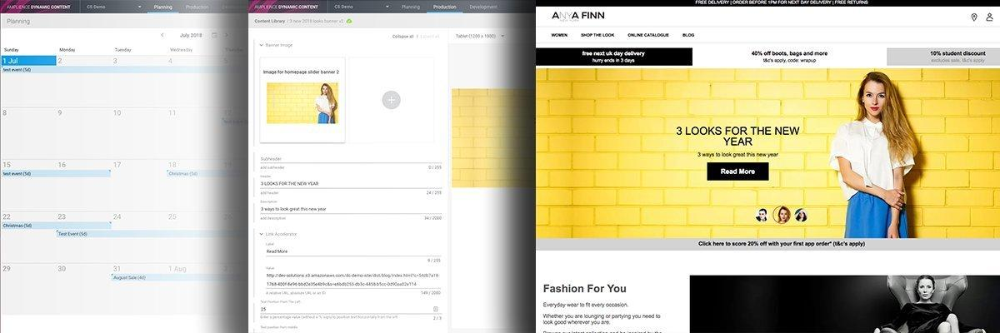

[](https://amplience.com/dynamic-content)

# Dynamic Content Accelerators - Rendering Service

> Extensible content types and rendering templates for use with the Amplience Rendering Service

[](https://github.com/amplience/dc-accelerators-content-rendering-service/releases/latest) [](https://opensource.org/licenses/Apache-2.0)

This project is designed to accelerate implementing Amplience Dynamic Content. It contains a set of commonly used components implemented as handlebars templates that can be rendered by the [Content Rendering Service](https://docs.amplience.net/integration/contentrenderingservice.html#the-content-rendering-service).

[](https://amplience.com/dynamic-content)

## Demo

* [Working demo](https://dev-solutions.s3.amazonaws.com/dc-demo-site/dist/homepage/index.html?c=d8b929ee-214d-48f0-90c0-4e121ca55a6f&s=e6bdb253-db3c-4458-b5cc-0d90aa02e114) of the accelerator components.

* [Component explorer](http://dev-solutions.s3.amazonaws.com/dc-renders-wireframe/dist/index.html?c=ab78c8be-9f03-4a52-bde0-4ebde03b79a3) showcasing the capability of each component.

## Getting started

### Developing components

This project has a local development environment which lets you test your component templates, styles and javascript without deploying them to Dynamic Content.

Steps:

1. Check-out the project
2. Install project dependencies
```js
npm install
```
3. Run development environment
```js
npm run storybook
```

This will launch a browser displaying the components using [Storybook](https://storybook.js.org/), a popular component explorer. Any changes made to template files, styles or Javascript will reload automatically.

See the [documentation](#documentation) links below for further details.

### Exporting components

Before you can deploy the components you need to run the export process. This will compile, concatenate and minify the CSS & JavaScript as well as collect the templates, icons and content types into a folder to ease deployment.


Ensure gulp-cli is installed:
```
npm install --global gulp-cli
```

Run gulp:

```
gulp
```

This will export the following files:

| file                | description                                                                                                                                                            |
|---------------------|------------------------------------------------------------------------------------------------------------------------------------------------------------------------|
| dist/contentTypes   | [Content Types](https://docs.amplience.net/integration/contenttypes.html) which define the content structure for each component.                                        |
| dist/templates      | [Content Rendering Service](https://docs.amplience.net/integration/contentrenderingservice.html#the-content-rendering-service) templates which render content to HTML. |
| dist/icons          | Icons for each component.                                                                                                                                              |
| dist/styles.min.css | CSS Styles for the components.                                                                                                                                         |
| dist/utils.min.js   | JavaScript which adds functionality to the components.                                                                                                                 |
| dist/lory.min.js    | [JavaScript Library](https://github.com/loryjs/lory) required by the Slider component.                                                                                 |

### Deploying components

To make use of these components in your application you must configure them in your Amplience account in addition to including the CSS & JavaScript in your project. The guide below explains how to deploy each type of resource exported in the previous step.

#### Content Types


#### Content Rendering Templates


#### Image Transformation Templates


#### CSS & JavaScript

Include a reference to the CSS & JavaScript resources in your application.

```html
<link rel="stylesheet" href="dist/styles.min.css"/>
<script src="dist/utils.js"></script>
```

If you are using the Slider component also include the [lory library](https://github.com/loryjs/lory).

```html
<script src="dist/lory.min.js"></script>
```

Interactive components will automatically attach their functionality when the DOM has loaded. If your application asynchronously renders the components you can manually activate the components with the following JavaScript:

```js
if (window.AmpCa && window.AmpCa.Utils) {
   window.AmpCa.Utils.attachComponents();
}
```

## Documentation

* Hosting content types externally
* Creating new components
* Extending Storybook
* Template depencencies

## Getting Help
If you need help please reach out using one of the following channels:

* Ask a question on [StackOverflow](https://stackoverflow.com/) using the tag `amplience-dynamic-content`
* Contact your [Amplience Customer Success](https://amplience.com/customer-success) representative
* If you have found a bug please report it by [opening an issue](https://github.com/amplience/dc-accelerators-content-rendering-service/issues/new)

## License

This software is licensed under the [Apache License, Version 2.0](http://www.apache.org/licenses/LICENSE-2.0),

Copyright 2019 Amplience

Licensed under the Apache License, Version 2.0 (the "License");
you may not use this file except in compliance with the License.
You may obtain a copy of the License at

    http://www.apache.org/licenses/LICENSE-2.0

Unless required by applicable law or agreed to in writing, software
distributed under the License is distributed on an "AS IS" BASIS,
WITHOUT WARRANTIES OR CONDITIONS OF ANY KIND, either express or implied.
See the License for the specific language governing permissions and
limitations under the License.
